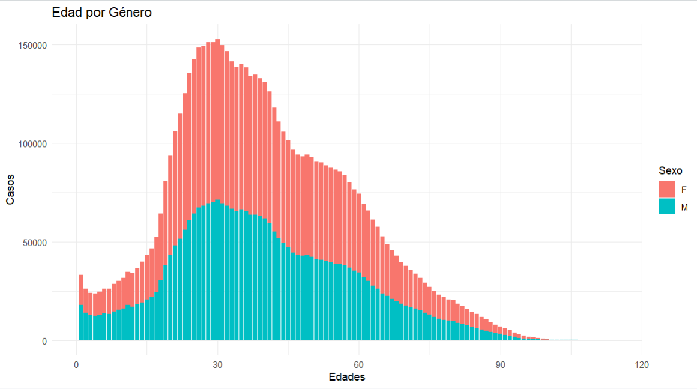
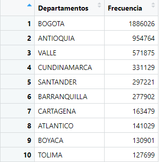
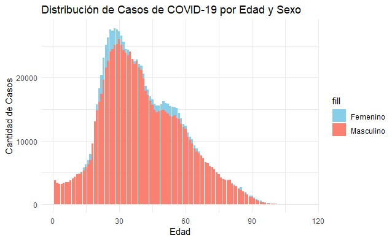
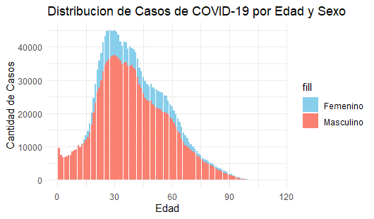

<style>
  body {
  text-align: justify}
</style>
<!-- esto es para justificar el texto -->


# Introducción

En el contexto desafiante que representa la pandemia de COVID-19, este proyecto de estadística se embarca en un análisis exhaustivo de datos exploratorios para arrojar luz sobre las correlaciones inherentes a la situación en Colombia. La magnitud de esta crisis global ha generado interrogantes cruciales que requieren una evaluación minuciosa. En este sentido, planteamos la siguiente interrogante central: ¿Cómo se correlacionan diversas variables relacionadas con el COVID-19 en el contexto colombiano? De esta pregunta central se desprenden las preguntas que serán respondidas en este análisis de datos exploratorio, las cuales son: 

  *Que distribución siguen los datos de los contagios por edad y por género?
  *¿Existe alguna tendencia en la relación entre la edad y la gravedad de los casos?
  *¿Cuales son los factores de riesgo de covid?
  *¿Cómo ha afectado la implementación de programas de vacunación a la tasa de contagio?


Abordamos este problema a través de una metodología estructurada. Comenzamos por adquirir un dataset exhaustivo que encapsula múltiples dimensiones de la pandemia en Colombia. A continuación, implementamos el análisis en el entorno de programación R, empleando gráficos para examinar la variación de variables correlacionables. La comparación de estas variaciones a lo largo del tiempo, a través de la comparación de gráficos de barras y otros gráficos estadísitcos, generados en distintas épocas temporales, nos proporcionará una visión profunda de las tendencias y patrones emergentes. Además, calcularemos medidas estadísticas pertinentes, desde medidas de tendencia hasta indicadores de variación, para evaluar el comportamiento de las variables y respaldar nuestras conclusiones.

Este análisis no se limitará a la simple observación de correlaciones superficiales; buscamos profundizar mediante una revisión crítica de la técnica analítica propuesta. Reconocemos la limitación inherente de simplemente observar las variaciones de las variables sin establecer una relación de causa-consecuencia. Para abordar esta falencia, complementaremos nuestro análisis con informes y análisis respaldados por fuentes externas. Si la evidencia refuta nuestras hipótesis, no dudaremos en presentarla y ajustar nuestras conclusiones en consecuencia.

La relevancia de este análisis no solo radica en su capacidad para confirmar conocimientos comunes, como la efectividad de la vacunación en la lucha contra la pandemia, sino también en su capacidad para revelar relaciones interesantes entre variables. Este enfoque no solo informará al espectador sobre la situación actual, sino que también fomentará la curiosidad y el entendimiento más profundo de los complejos matices relacionados con la pandemia de COVID-19.

# Paquetes usados
En este apartado se listan los paquetes que se necesitan instalar para poder correr el programa correctamente y recrear las simulaciones que el grupo realiza durante la realización de este proyecto. Estos paquetes son:

  * ggplot2: Es una poderosa librería de visualización de datos, que sigue el principio de "Grammar of Graphics". Desarrollada por Hadley Wickham, esta librería proporciona una manera elegante y flexible de crear gráficos de alta calidad, ofreciendo una manera intuitiva y poderosa de representar datos en R, facilitando la creación de visualizaciones informativas y estéticamente agradables.
  
  * rtools: A pesar de que "Rtools" no es un paquete específico en R; sino, un conjunto de herramientas necesarias para compilar paquetes desde el código fuente en R en entornos Windows, es necesario instalarlo, pues, con este es que se compila el código que se encuentra en el markdown de R, es decir, para compilar paquetes desde el código fuente en Windows, necesitas un conjunto de herramientas que proporcionen un entorno de compilación adecuado. En el contexto de R en Windows, este conjunto de herramientas es comúnmente conocido como "Rtools"
  
  * Dplyr: dplyr es una biblioteca de R que proporciona un conjunto de funciones para realizar operaciones de manipulación y transformación de datos de manera rápida y eficiente, lo que facilita la manipulación de datos mediante operaciones como filtrado, selección de columnas, creación de resúmenes y combinación de conjuntos de datos. Ayuda a escribir código más limpio y legible para tareas comunes de análisis de datos.
lubridate:

  * Lubridate: lubridate es una biblioteca de R diseñada para facilitar la manipulación y cálculos con fechas y horas, lo que simplifica la manipulación de objetos de fecha y hora, proporcionando funciones que facilitan la extracción de componentes de fecha (día, mes, año, etc.), la realización de operaciones aritméticas con fechas, y la conversión entre diferentes formatos de fecha y hora.

# Metodología y Resultados
En este análisis epidemiológico, nos sumergimos en un vasto océano de datos recopilados por el Instituto Nacional de Salud en Colombia desde el 27 de marzo de 2020 hasta el 29 de noviembre de 2023. Esta preciada información, extraída de notificaciones a SIVIGILA, revela el impacto del COVID-19 en el territorio colombiano. Entre sus datos importantes, encontramos la fecha de notificación a SIVIGILA, el nombre del municipio donde cada historia médica se desenvuelve, la edad del paciente, el tipo de contagio que desencadenó el padecimiento, la fecha de diagnóstico que señala el comienzo de la enfermedad, y la fecha de defunción de aquellos que perdieron su lucha contra el COVID-19.

En este *dataset* que muestra información sobre salud y protección social exploramos, no solo la propagación del virus, sino también las estrategias implementadas para contenerlo y las respuestas de las comunidades. Con la edad del paciente como una guía cronológica, trazamos los patrones que revelan vulnerabilidades específicas y triunfos en diferentes segmentos de la población.

Este conjunto de datos, más que meras cifras y fechas, es un tapiz que teje las adversidades de ciudades y pueblos, personas y comunidades, en su enfrentamiento contra la trágica pandemia que acarreó el COVID-19. En nuestro análisis, nos embarcamos en un análisis que descubre la realidad cotidiana, con la esperanza de que este conocimiento no solo informe, sino que inspire acciones y decisiones fundamentadas en el enfrentamiento continuo contra el remanente de la pandemia y/o futuras pandemias.

Esta sección se dividirá en sub-preguntas que serán respondidas de manera consecutiva a lo largo de la sección de metodología.

Para llevar a cabo el estudio sobre casos positivos de COVID-19 en colombia, se utilizo un conjunto de datos recopilado del sitio web oficial del Gobierno de Colombia (GOV.co). Para el uso del dataset se debe tener en cuenta cambiar el directorio de la carpeta, para esto cree una carpeta en el escritorio, dele el nombre que quiera a la carpeta y ahi ingresa el dataset, despues copie la direccion que se encuentra en la parte de arriba y peguela en el codigo, de esta manera podra hacer uso del dataset sin errores.

<br>
Para analizar esta información, primero se hizo la carga de datos desde un archivo CSV utilizando R y su entorno de desarrollo. Se utilizo la funcion <span style="text-decoration: underline;">**file.choose()**</span>
 para seleccionar el archivo y se asigno este conjunto de datos a la variable <span style="text-decoration: underline;">**covid**</span> utilizando la funcion <span style="text-decoration: underline;">**read.csv()**</span>. Luego para visualizar los datos y analizar su estructura se utilizó la función <span style="text-decoration: underline;">**View(covid)**</span>. Lo que nos permitio entender los tipos de variables y sus posibles valores.El código debajo muestra esto

Con el objetivo de analizar la distribución de los contagios por edad y género se realizó un proceso de corrección en la columna ("Sexo"). Para garantizar un análisis preciso, se llevo a cabo una revisión en busca de valores faltantes o vacíos en el conjunto de datos. 
<br>
Debido a que se identificó que existían discrepancias en los valores, algunos siendo registros "f" y "m" en lugar de "F" y "M" que representan "Femenino" y "Masculino".
Para resolver dichas inconsistencias, se utilizo una operación de condicional de la siguiente forma:
<br>

## ¿Cuál es la distribución de los contagios por edad y género?

El presente código se toma como base para responder esta pregunta: 

 
 ```{R, eval = FALSE}
install.packages("ggplot2")
library(ggplot2)

covid=read.csv( file.choose() )
View(covid)

# Corregir los valores en la columna de Sexo
covid$Sexo <- ifelse(covid$Sexo == "f", "F", ifelse(covid$Sexo == "m", "M", covid$Sexo))
# Corregir los valores en la columna de Nombre.departamento
covid$Nombre.departamento <- ifelse(covid$Nombre.departamento == "Caldas", "CALDAS", ifelse(covid$Sexo == "Cundinamarca", "CUNDINAMARCA", covid$Nombre.departamento))
covid$Nombre.departamento <- ifelse(covid$Nombre.departamento == "Putumayo", "PUTUMAYO", ifelse(covid$Sexo == "Santander", "SANTANDER", covid$Nombre.departamento))
covid$Nombre.departamento <- ifelse(covid$Nombre.departamento == "Tolima", "TOLIMA", covid$Nombre.departamento)

# Graficar la distribucion de los contagios por edad y genero
ggplot(covid, aes(x = Edad, fill = Sexo)) +
  geom_bar() +
  labs(title = "Edad por Género",
       x = "Edades",
       y = "Casos") +
  theme_minimal()

# Cantidad de mujeres y hombres en total
total_femenino <- sum(covid$Sexo == "F" & !is.na(covid$Sexo) & covid$Sexo != "")
total_masculino <- sum(covid$Sexo == "M" & !is.na(covid$Sexo) & covid$Sexo != "")
total_generos <- total_femenino + total_masculino
# Crear un data frame con los resultados
resultados <- data.frame(
  Genero = c("Femenino", "Masculino", "Total"),
  Cantidad = c(total_femenino, total_masculino, total_generos)
)
# Mostrar los resultados 
print(resultados)

# Revisar como se comportan las primeras edades respecto a los contagios
covid_edad_0_20 <- covid[covid$Edad >= 0 & covid$Edad <= 50, ]
ggplot(covid_edad_0_20, aes(x = factor(Edad), fill = Sexo)) +
  geom_bar() +
  labs(title = "Distribución de Edad por Género (0-20 años)",
       x = "Edad",
       y = "Cantidad de Casos") +
  theme_minimal() +
  theme(axis.text.x = element_text(angle = 90, vjust = 0.5, hjust=1))

# Obtener la frecuencia de registros para cada edad
frecuencia_edades <- table(covid$Edad)
View(frecuencia_edades)

frecuencia_departamentos <- table(covid$Nombre.departamento)
# Ordenar la tabla de mayor a menor frecuencia
frecuencia_ordenada <- sort(frecuencia_departamentos, decreasing = TRUE)
# Tomar las primeras 10 filas (las 10 primeras ciudades con más datos)
top_10_departamentos <- head(frecuencia_ordenada, 10)
# Crear un data frame con las 10 primeras ciudades y sus frecuencias
top_10_df <- data.frame(Departamentos = names(top_10_departamentos), Frecuencia = as.vector(top_10_departamentos))
# Mostrar el data frame con las 10 primeras ciudades en una tabla
View(top_10_df)

# Revisar el valor minimo y maximo de la variable de edad

min_edad <- min(covid$Edad)
max_edad <- max(covid$Edad)
print(paste("La edad mínima en todo el conjunto de datos es:", min_edad))
print(paste("La edad máxima en todo el conjunto de datos es:", max_edad))

# Revisar si existen valores negativos o inesperados en la variable de edades
valores_nulos <- sum(is.na(covid$Edad))
valores_inesperados <- sum(covid$Edad < 0)  # Por si hay edades negativas, que no tendrían sentido
if (valores_nulos > 0) {
  print(paste("Hay", valores_nulos, "valores nulos en la columna de Edad."))
} else {
  print("No hay valores nulos en la columna de Edad.")
}
if (valores_inesperados > 0) {
  print(paste("Hay", valores_inesperados, "valores de edad inesperados (negativos) en la columna de Edad."))
} else {
  print("No hay valores inesperados negativos en la columna de Edad.")
}

# Intervalo de edades de 20
intervalos_edades <- cut(covid$Edad, breaks = seq(0, max(covid$Edad) + 20, by = 20))
# Contar la frecuencia de personas en cada intervalo
conteo_intervalos <- table(intervalos_edades)
intervalo_mas_personas <- names(conteo_intervalos)[which.max(conteo_intervalos)]
print(paste("El intervalo con mayor cantidad de personas es:", intervalo_mas_personas))

# Calcular la cantidad total de mujeres en el conjunto de datos
total_mujeres <- sum(covid$Sexo == "F")
# Calcular la proporción de mujeres en el conjunto de datos
proporcion_mujeres <- total_mujeres / nrow(covid)
proporcion_esperada <- 0.5  
sesgo_general <- proporcion_mujeres - proporcion_esperada
# Mostrar el resultado del sesgo general
print(sesgo_general)
```

La distribución que se ha explorado considera la relación entre la cantidad de contagios por COVID-19 y la variable sexo que despliega datos como fenemeninos denotado por "F" y masculino por "M". Se observa una tendencia que indica una similitud con una distribución binomial negativa.


Podemos afirmar dicha distribución ya que el valor del sesgo esta dado por 0.03464445 lo que nos indica una inclinación o desviación en la distribución de los datos hacia el extremo derecho. Esto nos indica que en ciertos intervalos de edades encontramos mayor frecuencia de registros. Analizando un poco mas la distribución podemos denotar los outliers como edades muy poco comunes que se extienden hasta la edad maxima de 114 años y su edad minima 1 año, en las cuales podemos calcular un mayor numero de personas en los intervalos de (20,40] años lo que nos puede expresar el pico de esta distribución.

<br>
Haciendo énfasis en el diagrama anterior podemos denotar un diferencia notable de datos del sexo Femenino sobre el sexo Masculino, esto puede ser debido a diferentes factores como: Según el Departamento Administrativo Nacional de Estadística (DANE), Colombia tiene una población de 48,2 millones de personas. Del total de habitantes, el 51,2% son mujeres y el 48,8% son hombres. En 21 zonas del país, las mujeres tienen mayor presencia.
Esta disparidad entre distribuciones se debe a esto mismo ya que entre los departamentos que tiene mas registros se encuentran la gran mayoria de los departamentos que el DANE menciona en sus estudios.




  
## ¿Existe alguna tendencia en la relación entre la edad y la gravedad de los casos?

El siguiente código sirve para responder las siguientes preguntas: . Pero, se coloca aquí debido a que está comentado y segmentado para un mejor entendimiento.
  
```{r Código para responder la pregunta 2 y 3, eval=FALSE }

install.packages("ggplot2")
library(ggplot2)
covid=read.csv( file.choose() )
View(covid)

# //////////////////////¿Existe alguna tendencia en la relación entre la edad y la gravedad de los casos? (hombres viejos)//////////////////////


# Filtrar las observaciones mayores a 60 años
covid_datos <- covid[covid$Edad > 60, ]

# Crear un gráfico de barras para visualizar la tendencia
ggplot(covid_datos, aes(x = Edad, fill = Estado)) +
  geom_bar(position = "dodge", stat = "count") +
  labs(title = "Tendencia entre Edad > 60 y Estado",
       x = "Edad",
       y = "Número de Personas") +
  scale_fill_manual(values = c("Leve" = "green", "Fallecido" = "red")) +
  theme_minimal()


# //////////////////////¿Cuales son los factores de riesgo de covid?//////////////////////

 

# Corregir los valores en la columna de Sexo
covid$Sexo <- ifelse(covid$Sexo == "f", "F", ifelse(covid$Sexo == "m", "M", covid$Sexo))

# Graficar la distribucion de los contagios por edad y genero

ggplot(covid, aes(x = Edad, fill = Sexo)) +
  geom_bar() +
  labs(title = "Distribución de Edad por Género",
       x = "Edad",
       y = "Cantidad de Casos") +
  theme_minimal()

total_femenino <- sum(covid$Sexo == "F" & !is.na(covid$Sexo) & covid$Sexo != "")
total_masculino <- sum(covid$Sexo == "M" & !is.na(covid$Sexo) & covid$Sexo != "")
total_generos <- total_femenino + total_masculino


# Crear un data frame con los resultados
resultados <- data.frame(
  Genero = c("Femenino", "Masculino", "Total"),
  Cantidad = c(total_femenino, total_masculino, total_generos)
)


# Mostrar los resultados en forma tabular
print(resultados)

ggplot(covid, aes(x = Edad, fill = Sexo)) +
  geom_bar() +
  facet_wrap(~Recuperado) +  # Agrega facetas por el estado de recuperación
  labs(title = "Distribución de Edad por Género y Estado",
       x = "Edad",
       y = "Cantidad de Casos") +
  theme_minimal()


#sexo - Estado

# Corregir los valores en la columna de Sexo
covid$Sexo <- ifelse(covid$Sexo == "f", "F", ifelse(covid$Sexo == "m", "M", covid$Sexo))

# Cambiar los valores en la columna de Recuperado
covid$Recuperado <- ifelse(covid$Recuperado == "Recuperado", "Recuperado", "Fallecido")

# Graficar la distribución de los contagios por edad, género y estado de recuperación/fallecido
ggplot(covid, aes(x = Edad, fill = Recuperado)) +
  geom_bar() +
  facet_wrap(~Sexo) +  # Agrega facetas por el género
  labs(title = "Distribución de Edad por Estado de Recuperación/Fallecimiento y Género",
       x = "Edad",
       y = "Cantidad de Casos") +
  theme_minimal()

 # Ciudad - Estado

frecuencia_departamentos <- table(covid$Nombre.departamento)
# Ordenar la tabla de mayor a menor frecuencia
frecuencia_ordenada <- sort(frecuencia_departamentos, decreasing = TRUE)
# Tomar las primeras 10 filas (las 10 primeras ciudades con más datos)
top_10_departamentos <- head(frecuencia_ordenada, 10)
# Crear un data frame con las 10 primeras ciudades y sus frecuencias
top_10_df <- data.frame(Departamentos = names(top_10_departamentos), Frecuencia = as.vector(top_10_departamentos))
# Mostrar el data frame con las 10 primeras ciudades en una tabla
View(top_10_df)

#Corregir valores
covid$Nombre.departamento <- ifelse(covid$Nombre.departamento == "Caldas", "CALDAS", ifelse(covid$Sexo == "Cundinamarca", "CUNDINAMARCA", covid$Nombre.departamento))
covid$Nombre.departamento <- ifelse(covid$Nombre.departamento == "Putumayo", "PUTUMAYO", ifelse(covid$Sexo == "Santander", "SANTANDER", covid$Nombre.departamento))
covid$Nombre.departamento <- ifelse(covid$Nombre.departamento == "Tolima", "TOLIMA", covid$Nombre.departamento)

ggplot(covid, aes(x = Nombre.departamento, fill = Recuperado)) +
  geom_bar(position = "stack") +
  labs(title = "Distribución de Casos por Ciudad y Estado",
       x = "Nombre_departamento",
       y = "Cantidad de Casos") +
  theme_minimal() +
  theme(axis.text.x = element_text(angle = 45, hjust = 1))  # Rotar las etiquetas del eje x para mayor legibilidad


```

Teniendo en cuenta el texto y gráficas anteriores (Que se pueden revisar poinendo "eval=TRUE" en el chunk de código) se puede afirmar que si, primero que todo es tener en cuenta que la mayoria de adultos mayores se encuentran entre los 60 y 80 años, por lo que se observa en la grafica, la mayor cantidad de fallecidos se encuentra cerca aproximademente de los 80, mientras que la mayoria de personas en estado leve se encuentra cerca de los 60 años.

Tambien se llega a concluir que la grafica representa una Exponencial Negativa para la categoria de estado leve, mientras que para el estado fallecido llega a ser una hipergemotrica, principalmente se llega a esta conclusion por la asimetria que se puede observar en aproximadamente cerca de los 70-75 años.

## ¿Cuales son los factores de riesgo de covid? 

Se conoce como factor de riesgo como algo que aumenta la probabilidad de tener una enfermedad, puede ser desde algo externo como por ejemplo la ciudad o departamento donde vives, como de cosas mas personales como el genero, para eso se realizaron varios estudios donde se grafica la cantidad de personas que viven en una ciudad con respecto a su estado, el cual es recuperado o fallecido, y la cantidad de personas del genero masculino y del genero femenino con respecto al estado (Estos 2 en graficas aparte), para de esta manera, poder detectar en que ciudades se propago mas el Covid y que genero fue mas afectado, ademas de saber el estado de estos.


## ¿Cómo ha afectado la implementación de programas de vacunación a la tasa de contagio?

Primero, se importan los datos (Paso ya explicado en la primera pregunta de este apartado), tras esto, se instalan las librerías para graficar los datos y manipular las fechas. Este código es portable a cualquier máquina, debido a que, antes de leer el dataset, el usuario tiene que seleccionar la ubicación donde esté guardado el archivo, permitiendo que se encuentre en distintas carpetas, en distintos dispositivos y que, aun así, se lea el dataset exitósamente.  

Segundo, para llegar a una respuesta de esta pregunta, se deben analizar las graficas de contagio antes de la llegada de la vacunacion masiva y después de la llegada de la vacunacion masiva, sin embargo, debido a que la diferencia temporal entre el inicio de la vacuncación masiva (21 de febrero del 2021 para colombia, según el ministerio de salud [Ver referencias]) y la primera fecha de inicio de síntomas del paciente más antiguo es distinta de la diferencia temporal entre el inicio de la vacunación masiva y la última fecha de inicio de síntomas del paciente más reciente, se deben evaluar los datos sobre un mismo período de tiempo, pues, si no se hiciera esto, al evaluar los contagios antes del inicio de la vacunación masiva siempre saldrían menos contagios, debido a que hay muchos más casos después del inicio de la fecha de vacunación masiva y esto es porque ha habido mucho más tiempo para recolectar datos después de la fecha de inicio de vacunación masiva. Para este dataset, la fecha de inicio de síntomas más temprana es del 27 de febrero del 2020, lo que quiere decir que, entre esta fecha y el inicio de la vacunación masiva han pasado 359 días. Entonces, para que los períodos de tiempo sean equivalentes, el período de tiempo que se debe evaluar desde que inició la vacunación masiva en Colombia es desde el 20 de febrero del 2021 hasta el 14 de febrero del 2022. Esto se puede evaluar en el siguiente código

```{r Diferencia temporal antes y después de la vacunación masiva, echo=TRUE, eval=FALSE }

  covid <- read.csv( file.choose() );

aux1 <- as.Date( covid$Fecha.de.inicio.de.síntomas, format = "%Y-%m-%d" );

aux1 <- na.omit( aux1 );

valor_minimo <- min(aux1);

aux_text <- "La fecha de inicio de síntomas más antigua es: ";
aux_text <- paste( aux_text, valor_minimo );

print( aux_text )


```

Si la fecha de inicio de sintomas mas antigua resulta ser distinta, puede colocar ese valor en el coidgo de abajo

```{r Código para verificar que hayan 359 días entre ambos periodos temporales}

periodo_antes_de_vacunacion = as.Date("2021-02-20") - as.Date("2020-02-27");
periodo_despues_de_vacunacion = as.Date("2022-02-14") - as.Date("2021-02-20");

aux1 <- "La cantidad de días que hay entre la fecha de sintomas mas antigua y el inicio de la vacunacion masiva es: ";

aux2 <- "La cantidad de días que hay entre el inicio de la vacunacion masiva y el 14 de febrero del 2022 es: ";

aux1 <- paste( aux1, periodo_antes_de_vacunacion );
aux2 <- paste( aux2, periodo_despues_de_vacunacion );

print( aux1 );
print( aux2 )

```

Ahora, teniendo en cuenta esto, se pueden ejecutar estos dos chunks de código siguientes:

```{r Código para responder pregunta 4, eval=FALSE}

# Instalar y cargar las librerías necesarias si no las tienes instaladas

install.packages("dplyr")
install.packages("lubridate")
install.packages("ggplot2")

library(dplyr)
library(lubridate)
library(ggplot2)

covid <- read.csv( file.choose() );
View(covid)


# Filtrar por género (Femenino y Masculino)
casos_femenino <-  covid[(covid$Sexo == "F") & ( (as.Date( covid$Fecha.de.inicio.de.síntomas, "%Y-%m-%d" )) < (as.Date('20-02-2021', "%d-%m-%Y")) ), "Edad" ] ;

casos_femenino_sin_NA <- na.omit(  casos_femenino );

casos_femenino_sin_NA <- as.vector( casos_femenino_sin_NA );

# as.Date() es una función que convierte un string en un objeto tipo fecha
# funciona con dos argumentos: "2020-12-30" el string de la fecha
# y "%Y-%m-%d" el formato que, en este caso, indica que primero va el año
# luego una raya, luego el mes, luego una raya y, finalmente, el día


casos_masculino <-  covid[(covid$Sexo == "M") & ( (as.Date( covid$Fecha.de.inicio.de.síntomas, "%Y-%m-%d" )) < (as.Date('20-02-2021', "%d-%m-%Y")) ), "Edad" ] ;

casos_masculino_sin_NA <- na.omit(  casos_masculino );

casos_masculino_sin_NA <- as.vector( casos_masculino_sin_NA );


# Contar el número de casos por edad para cada género
conteo_edad_femenino <- table(casos_femenino_sin_NA)
conteo_edad_masculino <- table(casos_masculino_sin_NA)


# Crear un dataframe para usar en ggplot
data_femenino <- data.frame(
  Edad = as.numeric(names(conteo_edad_femenino)),
  Femenino = as.numeric(conteo_edad_femenino)
)

data_masculino <- data.frame(
  Edad = as.numeric(names(conteo_edad_masculino)),
  Masculino = as.numeric(conteo_edad_masculino)
)

# Unir los datos
merged_data <- merge(data_femenino, data_masculino, by = "Edad", all = TRUE)

# Gráfico de barras apiladas por edad y género
ggplot(merged_data, aes(x = Edad)) +
  geom_bar(aes(y = Femenino, fill = "Femenino"), stat = "identity") +
  geom_bar(aes(y = Masculino, fill = "Masculino"), stat = "identity") +
  labs(title = "Distribución de Casos de COVID-19 por Edad y Sexo",
       x = "Edad",
       y = "Cantidad de Casos") +
  scale_fill_manual(values = c("Femenino" = "skyblue", "Masculino" = "salmon")) +
  theme_minimal()

# Contar los valores únicos en la columna de sexo
conteo_sexo <- table(covid$Fecha.de.muerte)

# Mostrar los valores únicos y su frecuencia
print(conteo_sexo)


```


```{r Código para el periodo de tiempo despues de la vacunacion masiva, eval=FALSE}

# Instalar y cargar las librerC-as necesarias si no las tienes instaladas

install.packages("dplyr")
install.packages("lubridate")
install.packages("ggplot2")

library(dplyr)
library(lubridate)
library(ggplot2)

covid <- read.csv( file.choose() );
View(covid)


# Filtrar por gC)nero (Femenino y Masculino)
casos_femenino <-  covid[(covid$Sexo == "F") & ( (as.Date( covid$Fecha.de.inicio.de.síntomas, "%Y-%m-%d" )) >= (as.Date('20-02-2021', "%d-%m-%Y")) ) & ( (as.Date( covid$Fecha.de.inicio.de.síntomas, "%Y-%m-%d" )) < (as.Date('14-02-2022', "%d-%m-%Y")) ), "Edad" ] ;

casos_femenino_sin_NA <- na.omit(  casos_femenino );

casos_femenino_sin_NA <- as.vector( casos_femenino_sin_NA );

# as.Date() es una funciC3n que convierte un string en un objeto tipo fecha
# funciona con dos argumentos: "2020-12-30" el string de la fecha
# y "%Y-%m-%d" el formato que, en este caso, indica que primero va el aC1o
# luego una raya, luego el mes, luego una raya y, finalmente, el dC-a


casos_masculino <-  covid[(covid$Sexo == "M") & ( (as.Date( covid$Fecha.de.inicio.de.síntomas, "%Y-%m-%d" )) >= (as.Date('20-02-2021', "%d-%m-%Y")) ) & ( (as.Date( covid$Fecha.de.inicio.de.síntomas, "%Y-%m-%d" )) < (as.Date('14-02-2022', "%d-%m-%Y")) ), "Edad" ] ;

casos_masculino_sin_NA <- na.omit(  casos_masculino );

casos_masculino_sin_NA <- as.vector( casos_masculino_sin_NA );


# Contar el nC:mero de casos por edad para cada gC)nero
conteo_edad_femenino <- table(casos_femenino_sin_NA)
conteo_edad_masculino <- table(casos_masculino_sin_NA)


# Crear un dataframe para usar en ggplot
data_femenino <- data.frame(
  Edad = as.numeric(names(conteo_edad_femenino)),
  Femenino = as.numeric(conteo_edad_femenino)
)

data_masculino <- data.frame(
  Edad = as.numeric(names(conteo_edad_masculino)),
  Masculino = as.numeric(conteo_edad_masculino)
)

# Unir los datos
merged_data <- merge(data_femenino, data_masculino, by = "Edad", all = TRUE)

# GrC!fico de barras apiladas por edad y gC)nero
ggplot(merged_data, aes(x = Edad)) +
  geom_bar(aes(y = Femenino, fill = "Femenino"), stat = "identity") +
  geom_bar(aes(y = Masculino, fill = "Masculino"), stat = "identity") +
  labs(title = "Distribucion de Casos de COVID-19 por Edad y Sexo",
       x = "Edad",
       y = "Cantidad de Casos") +
  scale_fill_manual(values = c("Femenino" = "skyblue", "Masculino" = "salmon")) +
  theme_minimal()

# Contar los valores C:nicos en la columna de sexo
conteo_sexo <- table(covid$Fecha.de.muerte)

# Mostrar los valores C:nicos y su frecuencia
print(conteo_sexo)

```



Lo que se hace con estos códigos es lo siguiente: Se tiene en cuenta que todas las personas que se encuentran en ese dataset están contagiados, pues, todos tienen un valor distinto de cero en la columna "Fecha.de.inicio.de.síntomas". Teniendo esto en cuenta, simplemente cogemos la columna de edad y la guardamos en un vector. En este vector se cuenta cuantas veces aparece cada edad y se hace una gráfica donde la variable independiente es la edad de los pacientes y la variable dependiente es la cantidad de pacientes que poseen esa edad. Esto se hace por sexo, es decir, uno por masculino y otro por femenino. Como se puede observar en la gráfica, esta es más leptocurtic, es decir, más es más angosta, pero, llega más alto, debido a que nos encontrabamos en pleno pico de la pandemia, por lo tanto, el numero de casos aumentó exponencialmente, decretando un estado de emergencia sanitaria que puso a los servicios sanitarios de Colombia a máxima capacidad. Este pico fue a finales de agosto del 2021 (Según el apartado 4 de referencias). Aún así, se puede confiar en la efectividad de la vacunación, pues, como afirma el apartado 5 de las referencias "La proporción de casos de COVID-19 entre personas de ≥50 años y <50 años disminuyó significativamente (...)  Colombia, 20,8% (IC 95%: 20,6 a 21,1%)", reduciendo ampliamente la morbilidad de los pacientes de covid.


# Conclusión
La realización de un proyecto de estadística sobre la mortalidad y otros aspectos del COVID-19 proporciona una valiosa oportunidad para explorar y comprender la complejidad de las repercusiones de esta pandemia a través de una lente numérica y analítica. Al abordar la mortalidad, es esencial no solo cuantificar la magnitud de las pérdidas, sino también considerar las variables que pueden influir en los resultados, como la edad, el género, y las condiciones de salud preexistentes. Este análisis puede revelar patrones significativos que contribuyan a una comprensión más profunda de los factores de riesgo y las poblaciones más vulnerables.

Además de la mortalidad, la estadística también puede arrojar luz sobre otros aspectos críticos de la pandemia, como la propagación del virus, la eficacia de las medidas de mitigación y la distribución geográfica de los casos. La comparación de tasas de incidencia entre regiones puede proporcionar información valiosa para la toma de decisiones y la asignación de recursos.

Es crucial no perder de vista el contexto social, económico y de salud pública al interpretar los resultados estadísticos. Las discusiones deben abordar las implicaciones éticas y sociales de las medidas adoptadas, así como la equidad en el acceso a la atención médica y la distribución de las vacunas. La colaboración interdisciplinaria entre expertos en estadística, salud pública y ética puede enriquecer las interpretaciones y las recomendaciones resultantes.

En última instancia, un proyecto de estadística sobre el COVID-19 no solo busca cuantificar la magnitud de los desafíos que enfrentamos, sino también orientar las respuestas y las políticas de salud pública de manera informada y efectiva, con la esperanza de contribuir a la mitigación y prevención de futuras crisis sanitarias.

# Referencias
  1. Coronavirus. (s. f.). Who.int. Recuperado 4 de diciembre de 2023, de https://www.who.int/es/health-topics/coronavirus

  2. Instituto Nacional de Salud. (2020). Casos positivos de COVID-19 en Colombia [Data set].

  3. de Colombia, M. de S. y. P. S. (s. f.). Colombia comenzará la vacunación contra el covid-19 el 20 de febrero. Gov.co. Recuperado 7 de diciembre de 2023, de https://www.minsalud.gov.co/Paginas/Colombia-comenzara-la-vacunacion-contra-el-covid-19-el-20-de-febrero-.aspx

  4. Chaves Castro, Á. H. (2021). Análisis sobre la evolución del COVID-19 en Colombia: ¿se alcanzará el pico de contagio? Tiempo y economía, 8(1), 123–160. https://doi.org/10.21789/24222704.1672

  5. Sep, 1. (s/f). Impacto temprano de la vacunación contra la COVID-19 en poblaciones de edad avanzada en cuatro países de las Américas, 2021. Paho.org. Recuperado el 7 de diciembre de 2023, de https://www.paho.org/es/noticias/1-9-2023-impacto-temprano-vacunacion-contra-covid-19-poblaciones-edad-avanzada-cuatro

  

 <!--

# Encabezado 1

## Encabezado 2

### Encabezado 3

#### Encabezado 4


# Estética de letra

*Cursiva*


**Negrilla**

***Cursiva y negrilla***

> Añadir citación 

# Añdir link

[Este link es de cormoran](https://ingsistemas.uis.edu.co/eisi/)

# Añadir codigo en R
```{R, eval = FALSE}

summary(cars)


```


# Añadir codigo en R, pero, no evaluarlo (No ejecutar)
```{R, eval = FALSE}

supoekpoekmary(cars) #este comando está mal escroto

```


# Añadir codigo en R, pero, sólo mostrar el resultado de la ejecución
```{R, echo = FALSE}

summary(cars)

```


# Agregar tablas
```{R}

knitr::kable(
  
  head(cars),
  caption = "Esto es una tabla"
  
)

```

# Agregar figuras
<!-- dos espacios al final de la linea "  " añade una nueva línea (newlinde, endline) 
Hay 3 tipos de figuras:  
1. La que se genera desde el ambient de R

```{R}

plot(pressure)

```

<br>
<br>

2. Figuras que están descargadas en mi  
{width=50% height=50%} <!-- el ultimo corchete es para ajustar caracteristicas

<br>
<br>

3. Figuras que están en algún servidor checoslovaco
 <!-- el ultimo corchete es para ajustar caracteristicas


# Insertando ecuaciones
El segundo momento estadistico esta dado por: $\sigma^2[X] = E[X^2]-(E[X])^2$  

<br>

La pmf de la distribucion Binomial se escribe como:  

\begin{equation}
  f (k) = \binom{n}{k} p^k {1-p}^{n-k}
\end{equation}

# Agregar regla horizontal
 
 ---
 
 
# Agregando listas con viñetas
  * Un elemento de lista
  * Otra elemtno de lista
    + Un elemento de sublista
    + Otro elemnto de sublista
    
-->
