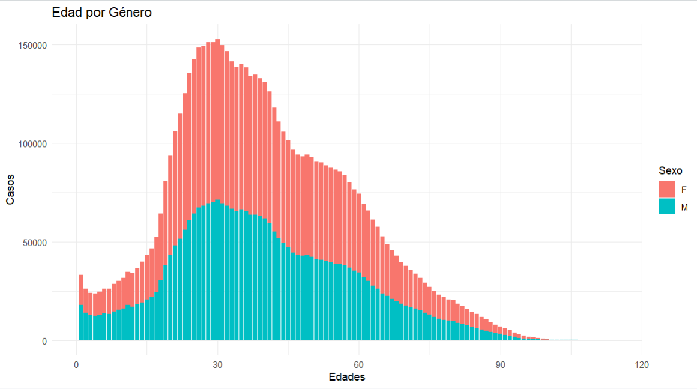
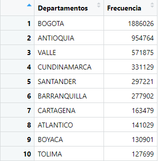

# Introducción

# Packages Required

```{R, eval = FALSE}
library(ggplot2)
```

# Metodología

Para llevar a cabo el estudio sobre casos positivos de COVID-19 en colombia, se utilizo un conjunto de datos recopilado del sitio web oficial del Gobierno de Colombia (GOV.co). Para el uso del dataset se debe tener en cuenta cambiar el directorio de la carpeta, para esto cree una carpeta en el escritorio, dele el nombre que quiera a la carpeta y ahi ingresa el dataset, despues copie la direccion que se encuentra en la parte de arriba y peguela en el codigo, de esta manera podra hacer uso del dataset sin errores.

<br>
Para analizar esta información, primero se hizo la carga de datos desde un archivo CSV utilizando R y su entorno de desarrollo. Se utilizo la funcion <span style="text-decoration: underline;">**file.choose()**</span>
 para seleccionar el archivo y se asigno este conjunto de datos a la variable <span style="text-decoration: underline;">**covid**</span> utilizando la funcion <span style="text-decoration: underline;">**read.csv()**</span>. Luego para visualizar los datos y analizar su estructura se utilizó la función <span style="text-decoration: underline;">**View(covid)**</span>. Lo que nos permitio entender los tipos de variables y sus posibles valores.
 
 ```{R, eval = FALSE}
install.packages("ggplot2")
library(ggplot2)
file.choose()
covid=read.csv("C:\\Users\\teams\\OneDrive\\Documentos\\Documentos\\Semestre 6\\Estadistica\\Proyecto_Final\\Base_De_Datos\\Casos_positivos_de_COVID-19_en_Colombia..csv")
View(covid)

# Corregir los valores en la columna de Sexo
covid$Sexo <- ifelse(covid$Sexo == "f", "F", ifelse(covid$Sexo == "m", "M", covid$Sexo))
# Corregir los valores en la columna de Nombre.departamento
covid$Nombre.departamento <- ifelse(covid$Nombre.departamento == "Caldas", "CALDAS", ifelse(covid$Sexo == "Cundinamarca", "CUNDINAMARCA", covid$Nombre.departamento))
covid$Nombre.departamento <- ifelse(covid$Nombre.departamento == "Putumayo", "PUTUMAYO", ifelse(covid$Sexo == "Santander", "SANTANDER", covid$Nombre.departamento))
covid$Nombre.departamento <- ifelse(covid$Nombre.departamento == "Tolima", "TOLIMA", covid$Nombre.departamento)

# Graficar la distribucion de los contagios por edad y genero
ggplot(covid, aes(x = Edad, fill = Sexo)) +
  geom_bar() +
  labs(title = "Edad por Género",
       x = "Edades",
       y = "Casos") +
  theme_minimal()

# Cantidad de mujeres y hombres en total
total_femenino <- sum(covid$Sexo == "F" & !is.na(covid$Sexo) & covid$Sexo != "")
total_masculino <- sum(covid$Sexo == "M" & !is.na(covid$Sexo) & covid$Sexo != "")
total_generos <- total_femenino + total_masculino
# Crear un data frame con los resultados
resultados <- data.frame(
  Genero = c("Femenino", "Masculino", "Total"),
  Cantidad = c(total_femenino, total_masculino, total_generos)
)
# Mostrar los resultados 
print(resultados)

# Revisar como se comportan las primeras edades respecto a los contagios
covid_edad_0_20 <- covid[covid$Edad >= 0 & covid$Edad <= 50, ]
ggplot(covid_edad_0_20, aes(x = factor(Edad), fill = Sexo)) +
  geom_bar() +
  labs(title = "Distribución de Edad por Género (0-20 años)",
       x = "Edad",
       y = "Cantidad de Casos") +
  theme_minimal() +
  theme(axis.text.x = element_text(angle = 90, vjust = 0.5, hjust=1))

# Obtener la frecuencia de registros para cada edad
frecuencia_edades <- table(covid$Edad)
View(frecuencia_edades)

frecuencia_departamentos <- table(covid$Nombre.departamento)
# Ordenar la tabla de mayor a menor frecuencia
frecuencia_ordenada <- sort(frecuencia_departamentos, decreasing = TRUE)
# Tomar las primeras 10 filas (las 10 primeras ciudades con más datos)
top_10_departamentos <- head(frecuencia_ordenada, 10)
# Crear un data frame con las 10 primeras ciudades y sus frecuencias
top_10_df <- data.frame(Departamentos = names(top_10_departamentos), Frecuencia = as.vector(top_10_departamentos))
# Mostrar el data frame con las 10 primeras ciudades en una tabla
View(top_10_df)

# Revisar el valor minimo y maximo de la variable de edad

min_edad <- min(covid$Edad)
max_edad <- max(covid$Edad)
print(paste("La edad mínima en todo el conjunto de datos es:", min_edad))
print(paste("La edad máxima en todo el conjunto de datos es:", max_edad))

# Revisar si existen valores negativos o inesperados en la variable de edades
valores_nulos <- sum(is.na(covid$Edad))
valores_inesperados <- sum(covid$Edad < 0)  # Por si hay edades negativas, que no tendrían sentido
if (valores_nulos > 0) {
  print(paste("Hay", valores_nulos, "valores nulos en la columna de Edad."))
} else {
  print("No hay valores nulos en la columna de Edad.")
}
if (valores_inesperados > 0) {
  print(paste("Hay", valores_inesperados, "valores de edad inesperados (negativos) en la columna de Edad."))
} else {
  print("No hay valores inesperados negativos en la columna de Edad.")
}

# Intervalo de edades de 20
intervalos_edades <- cut(covid$Edad, breaks = seq(0, max(covid$Edad) + 20, by = 20))
# Contar la frecuencia de personas en cada intervalo
conteo_intervalos <- table(intervalos_edades)
intervalo_mas_personas <- names(conteo_intervalos)[which.max(conteo_intervalos)]
print(paste("El intervalo con mayor cantidad de personas es:", intervalo_mas_personas))

# Calcular la cantidad total de mujeres en el conjunto de datos
total_mujeres <- sum(covid$Sexo == "F")
# Calcular la proporción de mujeres en el conjunto de datos
proporcion_mujeres <- total_mujeres / nrow(covid)
proporcion_esperada <- 0.5  
sesgo_general <- proporcion_mujeres - proporcion_esperada
# Mostrar el resultado del sesgo general
print(sesgo_general)
```
Con el objetivo de analizar la distribución de los contagios por edad y género se realizó un proceso de corrección en la columna ("Sexo"). Para garantizar un análisis preciso, se llevo a cabo una revisión en busca de valores faltantes o vacíos en el conjunto de datos. 
<br>
Debido a que se identificó que existían discrepancias en los valores, algunos siendo registros "f" y "m" en lugar de "F" y "M" que representan "Femenino" y "Masculino".
Para resolver dichas inconsistencias, se utilizo una operación de condicional de la siguiente forma:
<br>

## ¿Cuál es la distribución de los contagios por edad y género?

La distribución que se ha explorado considera la relación entre la cantidad de contagios por COVID-19 y la variable sexo que despliega datos como fenemeninos denotado por "F" y masculino por "M". Se observa una tendencia que indica una similitud con una distribución binomial negativa.


Podemos afirmar dicha distribución ya que el valor del sesgo esta dado por 0.03464445 lo que nos indica una inclinación o desviación en la distribución de los datos hacia el extremo derecho. Esto nos indica que en ciertos intervalos de edades encontramos mayor frecuencia de registros. Analizando un poco mas la distribución podemos denotar los outliers como edades muy poco comunes que se extienden hasta la edad maxima de 114 años y su edad minima 1 año, en las cuales podemos calcular un mayor numero de personas en los intervalos de (20,40] años lo que nos puede expresar el pico de esta distribución.

<br>
Haciendo énfasis en el diagrama anterior podemos denotar un diferencia notable de datos del sexo Femenino sobre el sexo Masculino, esto puede ser debido a diferentes factores como: Según el Departamento Administrativo Nacional de Estadística (DANE), Colombia tiene una población de 48,2 millones de personas. Del total de habitantes, el 51,2% son mujeres y el 48,8% son hombres. En 21 zonas del país, las mujeres tienen mayor presencia.
Esta disparidad entre distribuciones se debe a esto mismo ya que entre los departamentos que tiene mas registros se encuentran la gran mayoria de los departamentos que el DANE menciona en sus estudios.



# Resultados

# Discusión

# Conclusion

# Referencias
